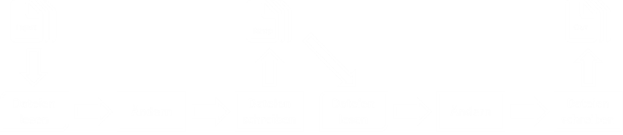
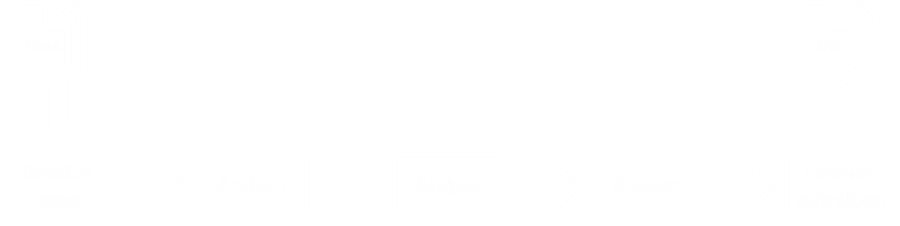

- title : gulp.js - DevMeetupK #02
- description : Introduction to FsReveal
- author : Karlkim Suwanmongkol
- theme : night
- transition : default

***

### the streaming build system

Sebastian Burgstaller

[@seburgi](https://twitter.com/seburgi) - [seburgi.com](http://seburgi.com)

***

### Was ist Gulp.js?
* Tool zur Automatisierung von oft ausgeführten Tasks
* Alternative zu Grunt
* Ideal für Continuous Integration

***

### Anwendungsbereiche
* Unit Tests
* Transpilieren von TypeScript, ES6
* Minification
* Concatenation
* Kompilieren von LESS nach CSS
* JS / CSS Code Analyse
* Hot-Reload
* Vendor prefixes
* Dateien in HTML injecten

***

### Was unterscheidet Gulp von Grunt?

* Code over Configuration
* Gulp Task === JavaScript code
* Streambasierte Verarbeitung von Dateien

---

### Dateibasierte Verarbeitung (Grunt)
 
 

---

### Streambasierte Verarbeitung (Gulp)
 
 

---

### Nochmal für visuelle Typen

***

### Vorbereitungen
* Kenntnisse in JavaScript
* Node.js installieren
* Text-Editor, oder IDE

---

### Node.js unter Windows
Chocolatey installieren ([https://chocolatey.org](https://chocolatey.org))

    
    @powershell -NoProfile -ExecutionPolicy Bypass -Command 
        "iex ((new-object net.webclient).DownloadString('https://chocolatey.org/install.ps1'))" && 
        SET PATH=%PATH%;%ALLUSERSPROFILE%\chocolatey\bin

Node.js mit Chocolatey installieren

    choco install node.install

---

### Node.js unter Ubuntu

    sudo apt-get update
    sudo apt-get install nodejs

---

### Node.js unter Mac OS X
Homebrew installieren ([http://brew.sh/](http://brew.sh/))

    ruby -e "$(curl -fsSL https://raw.githubusercontent.com/Homebrew/install/master/install)"

Node.js mit Homebrew installieren

    brew install node

---

### Gulp mit NPM installieren

    npm install gulp -D

---

### Gulp Datei erstellen

Minimalbeispiel für gulpfile.js:

    [lang=js]
    var gulp = require('gulp');

    gulp.task('default', function() {
            console.log("Gulp!");
        });

Hier der Output:

    d:/dev/gulp.simple> gulp
    [15:09:01] Using gulpfile d:/dev/gulp.simple/gulpfile.js
    [15:09:01] Starting 'default'...
    Gulp!
    [15:09:01] Finished 'default' after 361 μs

***

### Die 4 Api Methoden von Gulp
* gulp.task
* gulp.src
* gulp.dest
* gulp.watch

***

### 1. gulp.task

---

gulp.task(name [, dep], fn)

	[lang=js]
    gulp.task('default', function() {
        console.log("Gulp!");
    });

Registriert einen neuen Gulp Task. Optional können Tasks definiert werden die vorher ausgeführt werden müssen.

Der Task `default` wird dann aufgerufen, wenn man Gulp ohne Argumente aufruft.

---

## DEMO

---

gulp.task(name [, dep], fn)

	[lang=js]
	gulp.task('js', ['clean', 'jshint'], function() {
        console.log("Gulp!");
	});

Die Gulp Tasks `clean` und `jshint` werden vor `js` ausgeführt.

 

Wird folgendermaßen aufgerufen:

    d:/dev/gulp.simple> gulp js

---

# !

Dependency Tasks werden parallelisiert ausgeführt.

Die Reihenfolge der Elemente im Array hat keine Bedeutung.

***

### 2. gulp.src

---

gulp.src(glob, [, options])

	[lang=js]
	gulp.task('js', function() {
		return gulp
			.src('./src/**/*.js')
			.pipe(concat('app.all.js'))
			.pipe(gulp.dest('./build/'));
		});

https://github.com/isaacs/node-glob

Gibt einen lesbaren Stream der entsprechenden Dateien zurück.

***

### 3. gulp.dest

---

gulp.dest(path [, options])

    [lang=js]
    gulp.task('js', function() {
        return gulp
            .src('./src/**/*.js')
            .pipe(concat('app.all.js'))
            .pipe(gulp.dest('./build/'));
        });

Gibt einen beschreibbaren Stream zurück. Datei-Objekte die in diesen Stream gepiped werden, landen auf der Festplatte.

---

## DEMO

***

### 4. gulp.watch

---

gulp.watch(glob [, opts], tasks || func)

    [lang=js]
    gulp.task('js-watcher', function() {
        gulp.watch(['js/**/*.js'], ['js']);
    });

#
    
    [lang=js]
    gulp.task('js-watcher', function() {
        gulp.watch('js/**/*.js', function(event) {
            console.log('File ' + event.path + ' was ' + event.type + '.');
        });
    }

Überwacht das Dateisystem und triggert Tasks, wenn Änderungen erkannt werden.

---

## DEMO

***

### Jetzt kennen wir alle Methoden von Gulp
### Fragen? :-)

***
## Viel Spaß beim Ausprobieren!

* Gulp: http://gulpjs.com/
* Gulp Plugins: http://gulpjs.com/plugins/
* Komplexes Beispiel: https://github.com/johnpapa/gulp-patterns
* Folien und Demos: https://github.com/seburgi/devmeetupk
* FsReveal: https://github.com/fsprojects/FsReveal

Sebastian Burgstaller

[@seburgi](https://twitter.com/seburgi) - [seburgi.com](http://seburgi.com)

