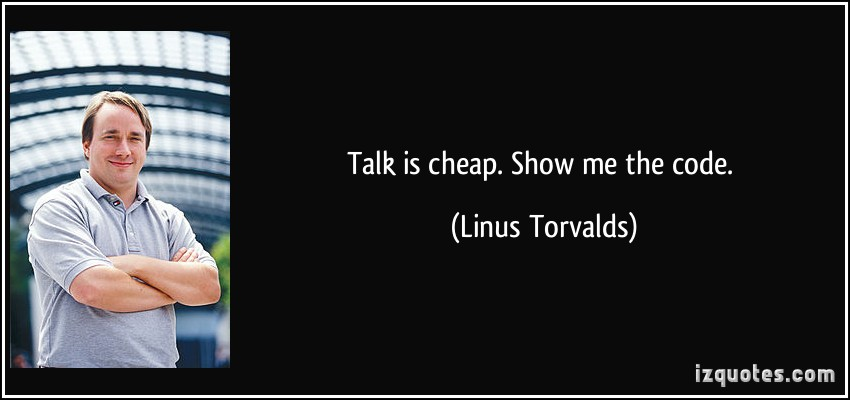
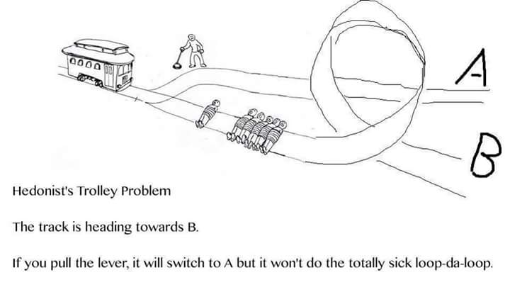
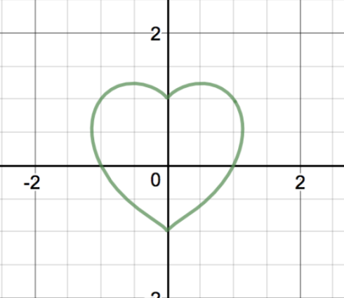

---

title : "Kotlin - Syntax and features"
theme : "white"
customTheme : "index"
highlightTheme : "github"
author : "Sebastian Burgstaller"

---

# Kotlin
## Syntax and features

<small>Created by [Sebastian Burgstaller](http://seburgi.com) / [@seburgi](http://twitter.com/seburgi)</small>

---

## Intro


--

## History

* JetBrains looked for a JVM language to replace Java
* Found Scala but were not satisfied
* 2010 Started development on Kotlin


note:
* Scala: slow compile speed, poor IDE support, language complexity

--

## History (2)

* 2011 Unveiled the project
* 2012 Open source (Apache 2)
* 2016 Kotlin v1.0 released
* 2017 Google announced first-class support for Android development

--

## Philosophy

Development lead Andrey Breslav says:

1. Industrial-strength object-oriented language
2. A "better language" than Java
3. Still be fully interoperable with Java code  
4. Allow companies to make a gradual migration from Java to Kotlin


--

## Why the name Kotlin?

Just like Java, Kotlin is also an island ;-)


--

#### What Kotlin has that Java does not
* Lambda expressions + Inline functions = performant custom control structures
* Null-safety
* Smart casts
* String templates
* Properties
* Extension functions

<small>
    https://kotlinlang.org/docs/reference/comparison-to-java.html
</small>


--

#### What Kotlin has that Java does not (2)
* Data classes
* Primary constructors
* Type inference for variable and property types
* Declaration-site variance & Type projections
* Range expressions

<small>
    https://kotlinlang.org/docs/reference/comparison-to-java.html
</small>

--

#### What Kotlin has that Java does not (3)
* Operator overloading
* First-class delegation
* Separate interfaces for read-only and mutable collections
* Coroutines

<small>
    https://kotlinlang.org/docs/reference/comparison-to-java.html
</small>

--



---

### Basic types and variables


--

## Basic types
* Numbers (`Byte, Short, Int, Long, Float, Double`)
* Literal constants:
    * Decimals: `42`
    * Hexadecimals: `0x0F`
    * Binaries: `0b0001001`
* Characters (`'A'` are not numbers)
* Booleans (`true`)
* Strings
* Arrays (`Array<Int>`)

--

### Defining variables
Assign-once (read-only) local variable:
``` kotlin
val a: Int = 1  // immediate assignment, type not necessary
val b = 2       // `Int` type is inferred

val c: Int      // Type required when no initializer is provided
c = 3           // deferred assignment
c = 4           // Compiler error! c is not mutable
```

* Semicolons are optional
* Names are more important than types

--

### Defining variables (2)
Some more examples:

``` kotlin
val isValid = true // type Boolean
val aChar = 'A' // type Char

val names = arrayOf("Peter", "Paul", "Mary") // create array
val anotherChar: Char = names[0][0] // first item in array, first char

val intArray = intArrayOf(1, 2, 3) // type IntArray
```

--

## Defining variables (3)
Mutable variable:

``` kotlin
var x = 5       // `Int` type is inferred
x += 1
```

--

### Strings

* Strings are immutable
* Elements of Strings are Chars
* Escaping is done with a backslash
* A String can be iterated over

``` kotlin
val str = "Hello, world!\n"

var startsWithH = str[0] == 'H'

for (c: Char in str) {
    println(c)
}
```

--

### String interpolation /
### template strings
``` kotlin
val s = "abc"
val str = "$s.length is ${s.length}"

// evaluates to "abc.length is 3"
```

--

### Multiline strings
``` kotlin
val shout = "Nice!"

val msg = """This is a multiline string
    |with margins that will be removed.
    |We can also interpolate here: $shout
    """.trimMargin() 
```

---

## Control flow



--

## If expression
``` kotlin
// Traditional usage 
var max = a 
if (a < b) max = b

// With else 
var max: Int
if (a > b) {
    max = a
} else {
    max = b
}
 
// As expression 
val max = if (a > b) a else b
```

note:
* if is an expression
* therefore no ternary operator

--

## When expression
``` kotlin
when (x) {
    1 -> print("x == 1")
    2 -> print("x == 2")
    else -> { // Note the block
        print("x is neither 1 nor 2")
    }
}
```

note:
* replaces switch operator of C-like languages

--

## When expression (2)
``` kotlin
when (x) {
    1, 2 -> print("x == 1 or x == 2")
    in 3..10 -> print("x is in the range")
    !in 11..20 -> print("x is outside the range")
    else -> print("none of the above")
}
```

3..10 creates a IntRange object

--

## When expression (3)
Without argument
``` kotlin
when {
    x.isOdd() -> print("x is odd")
    x.isEven() -> print("x is even")
    else -> print("x is funny")
}
```

--

## When expression (4)

Smart casts
``` kotlin
val event: DomainEvent = eventQueue.next()

when(event) {
    is ItemAdded -> println("Added item: ${event.newItemId}")
    is ItemRemoved -> println("Removed item: ${event.removedItemId}")
    else -> throw DomainException("Unknown event")
}
```

* Why don't we get a compiler error here? We are accessing members of a specific type!

--


# WTF?!

--

### Breakout: Smart casts

``` kotlin
val x: Any = ...

// x is automatically cast to string on the right-hand side of `||`
if (x !is String || x.length == 0) return

// x is automatically cast to string on the right-hand side of `&&`
if (x is String && x.length > 0) {
    print(x.length) // x is automatically cast to String
}
```
Whenever we:
* check the type of a variable with `is` the compiler automatically inserts safe casts.
* check a nullable variable for `null` this variable is known to be not null to the compiler.

note:
The rest of the current scope can now access members directly


--

### For loop
``` kotlin
for(x in 1..10) {
    print("$x ")
}
// prints 1 2 3 4 5 6 7 8 9 10


for(x in 1 until 10) {
    print("$x ")
}
// prints 1 2 3 4 5 6 7 8 9
```

--

### For loop (2)
``` kotlin
for(x in 1 until 10 step 2) {
    print("$x ")
}
// prints 1 3 5 7 9


for(x in 10 downto 1) {
    print("$x ")
}
// prints 10 9 8 7 6 5 4 3 2 1

```

--

### For loop (3)
``` kotlin
val colors = listOf("red", "green", "blue")

for(c in colors) {
    print("$c ")
}

// prints red green blue

```

--

### While loop
``` kotlin
while (x > 0) {
    x--
}

do {
    val y = retrieveData()
} while (y != null) // y is visible here!
```

---

## `fun` with functions



--

### Entry point
``` kotlin
fun main(args : Array<String>) {
    println("Hello")
}
```

--

### Function without return type
``` kotlin
fun sayHello(name: String) {
    println("Hello $name")
}

// is equivalent to

fun sayHello(name: String): Unit {
    println("Hello $name")
}
```

Unit is equivalent to void in Java

--

### Function with return type
``` kotlin
fun sum(a: Int, b: Int): Int {
    return a + b
}
```
or instead:

``` kotlin
fun sum(a: Int, b: Int) = a + b
```

--

### Named and default arguments
``` kotlin
fun say(msg: String = "Hello", name: String = "DevMeetupK") {
    println("$msg $name")
}

say() // prints "Hello DevMeetupK"
say("Hi") // prints "Hi DevMeetupK"
say("Hi", "see:PORT") // prints "Hi see:PORT"
say(name = "see:PORT") // prints "Hello see:PORT"
say(name = "see:PORT", msg = "Hi") // prints "Hi see:PORT"

say(null, null) // Compiler error!

```

* Think before coding!
* But why does the last call not compile?!

note:
* great for utility functions
* WTF?!

--


# WTF?!

--

### Breakout: Null safety
* Kotlin's type system aims to eliminate the danger of null references (the billion dollar mistake)
* Passing around null or assigning it to variables is almost impossible
* Possible causes of NullPointerExceptions are
    * An explicit call to `throw NullPointerException();`
    * Usage of the shoot-yourself-in-the-foot operator `!!`
    * Some rare edge cases caused by inheritance and uninitialized state

note:
* https://en.wikipedia.org/wiki/Tony_Hoare
* 1965
* Language ALGOl W

--

### Breakout: Null safety (2)

``` kotlin
var a: String = "abc"
a = null // compilation error

// but

var b: String? = "abc"
b = null // ok

println(b!!) // bang bang, only for NPE-lovers :-)
```

* This is one of THE best features of Kotlin!

note:
* back to fun with functions

--

### Breakout: Null safety (3)
#### Safe Call Operator

``` kotlin
val b: String? = null

b?.length // evaluates to null

// can be chained
bob?.department?.head?.name

// can also be used on the left side of an assignment
person?.department?.head = managersPool.getManager()

```

--

### Breakout: Null safety (4)
#### Elvis Operator

``` kotlin
val l: Int = if (b != null) b.length else -1

// or with the power of Elvis
val l = b?.length ?: -1

// nice for precondition checking
fun foo(node: Node): String? {
    val parent = node.getParent() ?: return null
    val name = node.getName() ?: throw IllegalArgumentException("name expected")
    // ...
}

```

* Did you spot it? The right side of an elvis operator can be an expression.

--

### Extension functions
``` kotlin
fun <T> MutableList<T>.swap(index1: Int, index2: Int) {
    val tmp = this[index1] // 'this' corresponds to the list
    this[index1] = this[index2]
    this[index2] = tmp
}

val l = mutableListOf(1, 2, 3)
l.swap(0, 2)
```

note:
* Extension functions are resolved statically.
* During compile time!
* Recommendation is to use extension functions freely, I would say take a long, hard look and then decide where your new extension functions should be visible

--

### Lambdas

``` kotlin
val sum = { x: Int, y: Int -> x + y }

// or instead

val sum: (Int, Int) -> Int = { x, y -> x + y }

// in any case

sum(1, 2) // returns 3

```

* Lambdas are literals of function types.

--

### Lambdas (2)
#### Higher order functions
``` kotlin
fun <T> lock(lockObject: Lock, body: () -> T): T {
    lockObject.lock()
    try {
        return body()
    }
    finally {
        lockObject.unlock()
    }
}
```

``` kotlin
val result = lock(lockObject, { sharedResource.operation() })

// or instead

lock (lockObject) {
    sharedResource.operation()
}

```
Wait for it...

note:
* WTF? 

--


# WTF?!

--

### Breakout: DSLs with Kotlin
When the last parameter to a function is a function you can specify it outside of parentheses in a block.

``` kotlin
System.out.appendHTML().html {
	body {
		div {
			a("http://kotlinlang.org") {
				target = ATarget.blank
				+"Main site"
			}
		}
	}
}
```

<small>
See https://github.com/kotlin/kotlinx.html for more info.
</small>

note:
* great for DSLs, or cross cutting concerns

--

### Breakout: DSLs with Kotlin (2)

``` kotlin
import org.gradle.api.plugins.ExtensionAware
import org.junit.platform.gradle.plugin.FiltersExtension
import org.junit.platform.gradle.plugin.EnginesExtension

// setup the plugin
buildscript {
    dependencies {
        classpath("org.junit.platform:junit-platform-gradle-plugin:1.0.0")
    }
}

apply {
    plugin("org.junit.platform.gradle.plugin")
}

...
```

<small>
See https://github.com/gradle/kotlin-dsl for more info.
</small>

note:
* Kotlin language support for Gradle build scripts
* Functions in functions in functions
* Back to lambdas

--

### Lambdas (3)

``` kotlin
val addOp = { x: Int, y: Int -> x + y }
val subtractOp = { x: Int, y:Int -> x - y }

fun executeOp(x: Int, y: Int, op: (Int, Int) -> Int) =
    op(x, y);

executeOp(1, 2, addOp).also { println(it) }; // prints 3
executeOp(1, 2, subOp).also(::println); // prints -1

```

* Lambdas can be composed => passed around as function arguments
* Named functions can be converted to lambdas with the :: operator
* `let, also, apply, run, with` are just functions (defined by Kotlin standard lib)

note: BTW every named function can be converted to a lambda with the :: operator

--

### Lambdas (4)

``` kotlin
val ints = 0..10 // IntRange

ints.filter { it % 2 == 0 }.forEach(::println)
// prints 0 2 4 6 8 10

mapOf(
    "Peter" to "Red",
    "Paul" to "Green",
    "Mary" to "Blue"
) // Map<String, String>
    .filter { entry -> entry.key == "Mary" }
    .filter { (person, color) -> person == "Mary" } // redundant
    .forEach(::println); // prints Mary=Blue

```

What would you say if I told you that we are actually calling the same `filter` overload here? :-)

note:
* The second `filter` call is redundant
* WTF? 

--


# WTF?!

--

### Breakout: Destructuring Declarations


* Use it in lambdas or `for` loops
* Declare and initialize multiple variables from an object at once

``` kotlin
val (person, color) = mapEntry;
```

* Can be used whenever `component` functions can be called on an object.
``` kotlin
val person = mapEntry.component1()
val color = mapEntry.component2()
```

* Could be member funcs OR extension funcs.

note:
* This means, we can destructure objects that we didn't write, for example from external libs
* Beware the differences to JavaScript, name of new variables does not have any meaning

---

### Classes and objects


--

### Creating Classes
``` kotlin
class Invoice {
}

class Person(firstName: String) {
    val firstName = firstName;
}

class Person(val firstName: String, val lastName: String, var age: Int) {
    // ...
}

var p = Person("Steve")

```

--

### Creating Classes (2)
``` kotlin
class Person(firstName: String) {
    val firstName = firstName;
    var secondName: String? = null

    constructor(firstName: String, secondName: String)
        : this(firstName) {
        _secondName = secondName;
    }
}

class Person(firstName: String) {
    val firstName = firstName;

    private lateinit var _secondName: String
    val secondName: String
        get() = _secondName

    constructor(firstName: String, secondName: String)
        : this(firstName)
    {
        _secondName = secondName;
    }
}

class Person(val firstName: String, val secondName: String? = null) {
    // ...
}
```

* primary constructors need to be called from secondary constructors

--

### Referential equality?
``` kotlin
class Person(val firstName: String)

val p1 = Person("Steve")
val p2 = Person("Steve")

println(p1 == p2)
// computer says no :-(
```
    
You could override `equals()` and `hashCode()` functions

OR use the `data` keyword:

``` kotlin
data class Person(val firstName: String) 
// ..
println(p1 == p2) // evaluates to TRUE
```

--


# WTF?!

--

### Breakout: data classes

Provides the `Customer` class with the following functionality:

* getters (and setters in case of `var` s) for all properties
* `equals()`
* `hashCode()`
* `toString()`
* `copy()`
* `component1()`, `component2()`, ..., for all properties

--

### Breakout: data classes
``` kotlin
data class Person(val firstName: String, val secondName: String) 

val p1 = Person("Steve", "Woz")
println(p1) // prints Person(firstName=Steve, secondName=Woz)

val (firstName, secondName) = p1 // destructuring declaration

val p2 = p.copy(secondName = "the Woz") // copy and change
println(p2) // prints Person(firstName=Steve, secondName=the Woz)

p1 == p2 // evaluates to false
p2 == Person("Steve", "the Woz") // evaluates to true

```

note:
* back to OOP

--

### Inheritance

Let`'`s get this over with ;-)

* Yes, there is inheritance
* No, multiple inheritance is not possible
* But: interfaces can contain default implementations

``` kotlin
open class Person(val firstName: String)
class Customer(firstName: String) : Person(firstName)

interface MyInterface {
    fun bar()
    fun foo() {
        // optional body
    }
}
```

--

## Delegation
``` kotlin
interface Base {
    fun print()
}

class BaseImpl(val x: Int) : Base {
    override fun print() { print(x) }
}

// Derived receives an instance of Base
class Derived(b: Base) : Base by b

fun main(args: Array<String>) {
    val b = BaseImpl(10)
    Derived(b).print() // prints 10
}
```

---

### Coroutines
* coroutines were introduced with Kotlin 1.1 and are flagged experimental for now
* Somebody basically recreated C#s async / await on top of coroutines

``` kotlin
async {
   val repos = await { github.getRepos() }
   showList(repos)
   repos.forEach { repo ->
      val stats = await { github.getStats(repo.name) }
      showStats(repo, stats)
   }
}
```

<small>
    https://github.com/metalabdesign/AsyncAwait
</small>

--

## What I left out?

* [Generics](https://kotlinlang.org/docs/reference/generics.html)
* [Inline functions](https://kotlinlang.org/docs/reference/inline-functions.html)
* [Companion objects](https://kotlinlang.org/docs/reference/object-declarations.html#companion-objects)
* [Exceptions](https://kotlinlang.org/docs/reference/exceptions.html)
* [Sealed classes](https://kotlinlang.org/docs/reference/sealed-classes.html)
* [Java interop](https://kotlinlang.org/docs/reference/java-interop.html)

---


### This was a lot of information

--


### Thank you for your time!
* Kotlin can be used on the server, in mobile apps and for JavaScript development.
* It has immutability, null safety, data classes baked right in
* So bye, bye bad practices and verbose code! Hello Kotlin!

<small>Created by [Sebastian Burgstaller](http://seburgi.com) / [@seburgi](http://twitter.com/seburgi)</small>